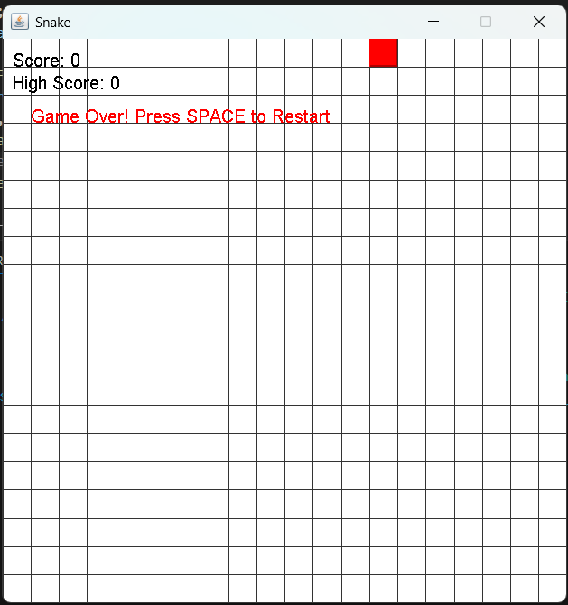

# 🐍 Snake Game - Java Swing Edition

A classic Snake Game implemented in Java using the Swing library for GUI. This version includes clean graphics, keyboard controls, game-over detection, and a **Restart** button.

---

## 📁 Project Structure

```
snake game/
├── App.java           # Main class that launches the game
├── SnakeGame.java     # Game logic and UI rendering
└── README.md          # Project documentation
```

---

## 🚀 How to Set Up and Run

### 🛠 Prerequisites
- **Java JDK 8 or above** (tested with JDK 17)
- Any Java IDE like IntelliJ IDEA, Eclipse, or just command-line tools

### ✅ Setup Steps

1. **Extract the ZIP**:
   ```
   unzip "snake game.zip"
   cd "snake game"
   ```

2. **Compile the Java Files**:
   ```
   javac App.java SnakeGame.java
   ```

3. **Run the Game**:
   ```
   java App
   ```

---

## 📦 Dependencies

This project uses only standard Java libraries:
- `javax.swing.*`
- `java.awt.*`
- `java.util.*`

No external dependencies are required.

---

## 🎮 Controls

| Key       | Action         |
|-----------|----------------|
| ↑         | Move Up        |
| ↓         | Move Down      |
| ←         | Move Left      |
| →         | Move Right     |
| [Button]  | Restart Game   |

---

## 🖼 Screenshots


---

## ⚠️ Troubleshooting

- If you see `"constructor SnakeGame(int, int) is undefined"`: ensure you're using the latest fixed code where the constructor is properly defined.
- If `requestFocus()` gives an error, make sure `SnakeGame` extends `JPanel`.

---

## 💡 Features to Add (Optional Ideas)

- Score counter
- Pause/Resume functionality
- Levels and increasing difficulty
- High score tracking
- Sound effects

---

## 👨‍💻 Author

This game was developed as a simple Java Swing GUI project. Modify and enhance as you wish!

---

## 📜 License

This project is open-source and available for educational use.
